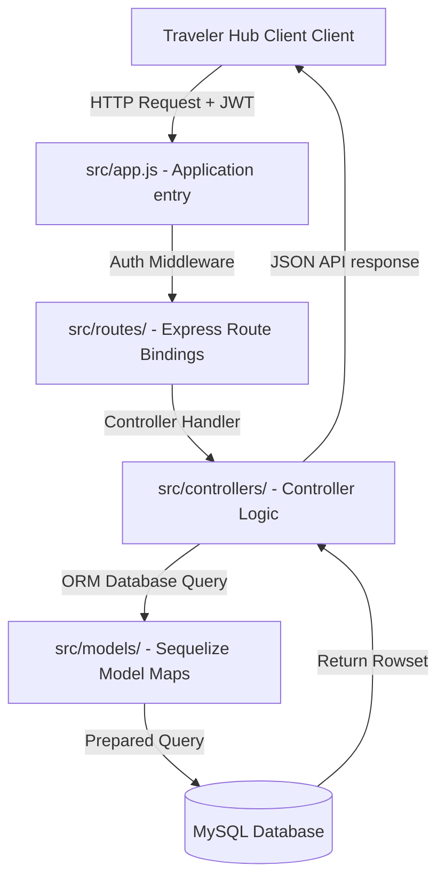

# Siwa Oasis Tourism API: Express.js Backend & Chatbot Telemetry Engine

<div align="center">
  
</div>

<div align="center">
      
</div>

خادم **سيوة البرمجي** هو محرك سحابي مبني باستخدام Node.js و Express.js لتنظيم معاملات الحجز ومصادقة المستخدمين وتتبع سجل الرسائل والمحادثات مع الذكاء الاصطناعي عبر قاعدة بيانات MySQL وباستخدام Sequelize ORM.

This repository holds the Node.js Express application, database models, Sequelize configuration parameters, and controllers for JWT security and chatbot history logs in the **Siwa Oasis Ecosystem**.

---

## 🧬 Core Services & REST Controllers

The backend contains modular handlers:

1.  **Sequelize Connectors (`src/config/`)**: Connection pooling parameters matching dialect databases.
2.  **ORM Database Models (`src/models/`)**: Maps relational databases:
    *   `user.model.js`: User accounts and hashed credential configurations.
    *   `booking.model.js`: Bus travel reservations and transaction tickets.
    *   `trip.model.js`: Destination catalogs, attractions, and locations.
    *   `chat.model.js`: Message records storing chatbot telemetry and user prompts.
3.  **Controllers (`src/controllers/`)**: Business logic executing queries for user auth, reservation tickets, trip logs, and assistant messages.
4.  **Security Routes (`src/routes/`)**: Express API route maps secured via JWT check middleware.

---

## 🧬 REST Request Lifecycle

The application maps requests via Express and Sequelize:



---

## 🛠️ Technology Stack & Architectures

*   **Runtime Environment**: Powered by **Node.js v18+**.
*   **HTTP Server**: Built using **Express.js** API sub-routers.
*   **Object-Relational Mapping (ORM)**: Configured using **Sequelize** for relational mapping.
*   **Database Engine**: Powered by **MySQL** relational database storage.
*   **Access Protections**: Encrypted authentication tokens utilizing JSON Web Tokens (**JWT**).

---

## 📂 Repository Module Layout

```text
siwa-oasis-tourism-api/
├── src/
│   ├── config/          # Sequelize configuration and database connect
│   ├── controllers/     # Controller logic implementations
│   ├── models/          # Sequelize database tables mapping
│   ├── routes/          # Express route bindings
│   └── app.js           # Server application startup setup
├── package.json         # Node.js dependencies configuration
└── README.md            # System documentation
```

---

## ⚡ Local Setup & Execution

### 📋 Prerequisites
* Node.js v18+ and a running MySQL instance

### ⚙️ Quick Start Steps
```bash
# 1. Clone the API repository
git clone https://github.com/Siwa-Oasis-Org/siwa-oasis-tourism-api.git
cd siwa-oasis-tourism-api

# 2. Install dependencies
npm install

# 3. Configure Database connection
# Set database connections, host, port, user and password inside configuration files

# 4. Start the server (Development mode)
npm run dev
```

---

## 📄 License
Licensed under the **MIT License**.
